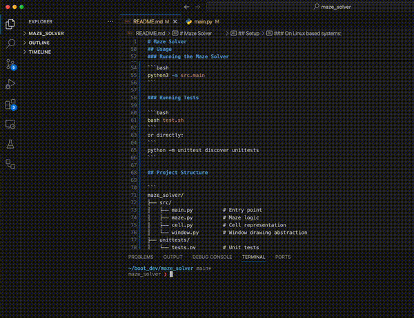

# Maze Solver 🧩🐍

A Python-based maze generator and solver using a recursive backtracking algorithm. Visualizes maze construction and pathfinding with a GUI window.

## Features

- Procedural maze generation with randomized paths
- Recursive backtracking algorithm to create and solve the maze
- Unit-tested core logic (cell creation, wall breaking, solving path)
- Support for deterministic randomness via a user-defined seed

## How It Works

- **Maze Generation**:
  - Grid of `Cell` objects initialized with all walls.
  - `_break_walls_r` uses randomized depth-first search to knock down walls and form a solvable maze.

- **Maze Solving**:
  - `solve()` starts at the top-left corner and recursively finds a path to the bottom-right.
  - `draw_move` and `draw_undo` methods visualize forward and backtracking steps.

- **Entrance/Exit**:
  - The top wall of the first cell and the bottom wall of the last cell are removed.

## Demo



## Requirements

- Python 3.10+
- `venv` for isolated environment

## Setup

```bash
# Create and activate a virtual environment
python3 -m venv venv
source venv/bin/activate  # On Windows use `venv\Scripts\activate`

# Install dependencies (if any)
pip install -r requirements.txt
```

### On Linux based systems:
```
sudo apt-get install python3-tk
```

## Usage

### Running the Maze Solver

```bash
python3 -m src.main
```

### Running Tests

```bash
bash test.sh
```
or directly:
```
python -m unittest discover unittests
```

## Project Structure

```
maze_solver/
├── src/
│   ├── main.py          # Entry point
│   ├── maze.py          # Maze logic
│   ├── cell.py          # Cell representation
│   └── window.py        # Window drawing abstraction
├── unittests/
│   └── tests.py         # Unit tests
├── test.sh              # Test runner script
├── requirements.txt     # Optional: dependencies list
└── README.md
```

### Customization

    Change CATPPUCCIN color scheme for different maze themes.

    Swap in your own rendering layer by adapting the Window interface.

### License

MIT License

Built with love and recursion 🌀

